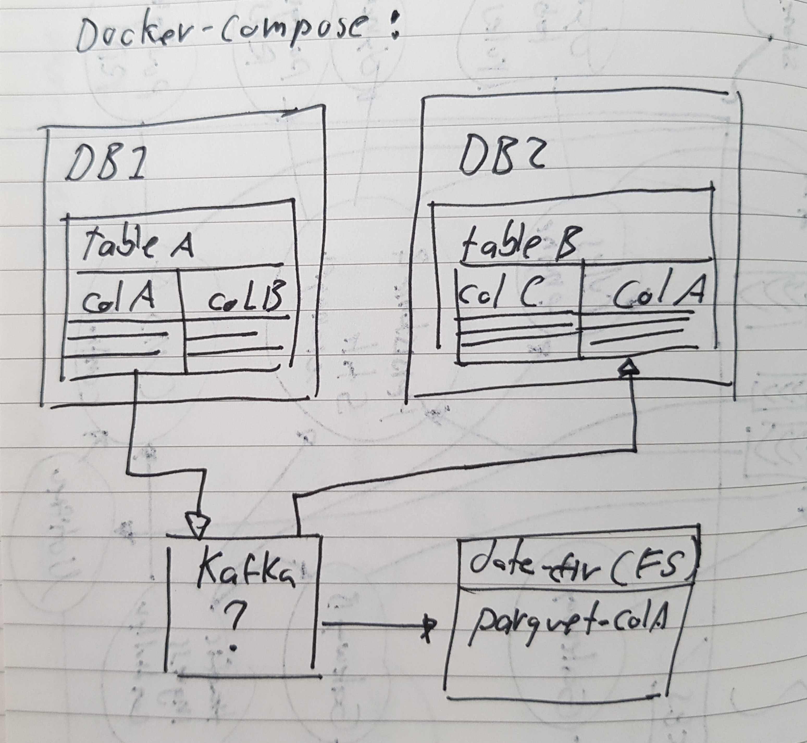

# kafka-data-replication-poc

## Plan

1. create a repo for the PoC
2. create the docker-compose file to spin up all the components
3. create the DBs schemas
4. create some script to populate the table dbs
5. configure the DB to kafka connector
6. configure the subscribers to write to DB
7. configure the subscirber to write to parquet
8. evaluate solution and document findings

## References

https://github.com/simplesteph/kafka-stack-docker-compose
https://github.com/wurstmeister/kafka-docker
https://github.com/wurstmeister/zookeeper-docker