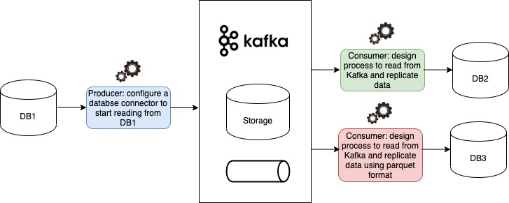
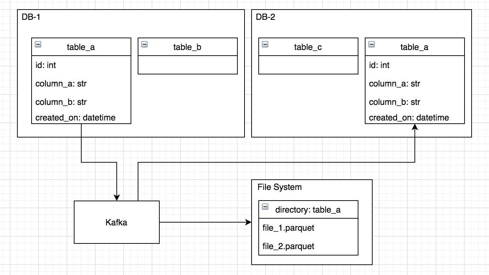
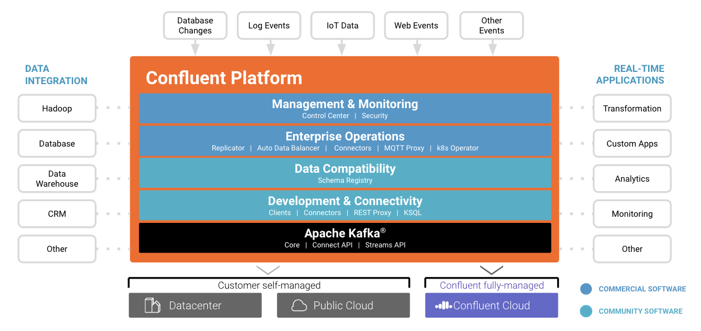
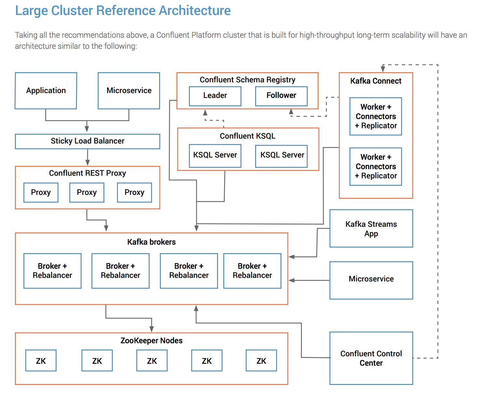

# kafka-data-replication-poc

The purpose of this PoC is to build a data replication solution between a database table and another database,
and a database table and parquet files.

Other objectives:

1. Understand how kafka and the confluent platform works
2. Compare it against DMS which can also be used for data replication purposes between dbs and a data-lake
3. Show that we can replicate tables and columns between different databases
4. Show how can kafka may be used for event-based/reactive architectures
5. Understand how to deploy and maintain a kafka solution in the cloud i.e. Confluent, AWS, GCP

Kafka has gained a lot of attention recently and is described as the cloud nervous system, it can be used for ETL,
as a streaming platform, and a broker for event based architectures.
It can be described as a cloud agnostic hybrid of a pub/sub, queue broker, and a database.
But it can be very complex, similar to a kubernetes cluster.



Image 2: Architecture Logic View



Image 2: Data Flows



Image 3: Confluent Platform



Image 4: Large Cluster Reference Architecture

## Plan

1. [x] create a repo for the PoC
2. [x] create the docker-compose file to spin up all the components
3. [x] create the DBs schemas
4. [x] create some script to populate the table dbs
5. [x] configure the DB to kafka connector
6. [x] configure the subscribers to write to DB
7. [ ] configure the subscriber to write to parquet
8. [ ] evaluate solution and document findings
9. [ ] deploy to AWS and GCP use-cases
10. [ ] evaluate solution and document findings for 9

## Running the PoC

1. prepare the environment `source bin/env`
2. build the container images `make build`
3. start the applications `make run`. NOTE: you may have to wait at least 30 seconds.
4. prepare the database `make initialize-dbs`
5. inject some data to the database `make inset-data`
6. configure the kafka cluster `make configure`
7. check status `make status`
8. insert more data `make inset-data` and check status `make status`
9. check replicated data:

```shell
psql $PSQL_1 -c "select * from table_a;"
psql $PSQL_2 -c "select * from table_a;"
```

NOTE: You can inspect the databases with:

- `psql $PSQL_1`
- `psql $PSQL_2`

## Steps to follow (PoC considering Java as programming language)

1. Download Postgres connector for Java (Check this since it is a connector for Java JDBC: https://www.confluent.io/hub/confluentinc/kafka-connect-jdbc)
2. Configure JDBC Source Connector (see: https://www.confluent.io/blog/kafka-connect-deep-dive-jdbc-source-connector/)
3. Configure Data Source properties (see step 4 in: https://www.tutorialkart.com/apache-kafka/kafka-connector-mysql-jdbc/)
4. Run the PoC. See next section
5. Start source connector (see step 6 in: https://www.tutorialkart.com/apache-kafka/kafka-connector-mysql-jdbc/)
6. As a example you can see how to start a console consumer (see step 7 in: https://www.tutorialkart.com/apache-kafka/kafka-connector-mysql-jdbc/)
7. Configure the consumer reading from the database (see: https://www.oreilly.com/library/view/kafka-the-definitive/9781491936153/ch04.html)

```txt
NOTE: Consider using brokers for a more complete example: https://www.tutorialspoint.com/apache_kafka/apache_kafka_cluster_architecture.htm
```

## Next Steps

- Deploy the same setup using the confluent platform and RDS in AWS
- Deploy the same setup using the k8s-kafka operator and RDS in AWS
- Deploy the same setup using the k8s-kafka operator and cloudsql in GCP

## References

- https://github.com/simplesteph/kafka-stack-docker-compose
- https://github.com/wurstmeister/kafka-docker
- https://github.com/wurstmeister/zookeeper-docker
- https://github.com/confluentinc/cp-docker-images
- https://github.com/authorjapps/zerocode-docker-factory/blob/master/compose/kafka-schema-registry.yml
- https://highalpha.com/data-stream-processing-for-newbies-with-kafka-ksql-and-postgres/
- https://github.com/mtpatter/postgres-kafka-demo
- https://debezium.io/documentation/reference/1.0/architecture.html
